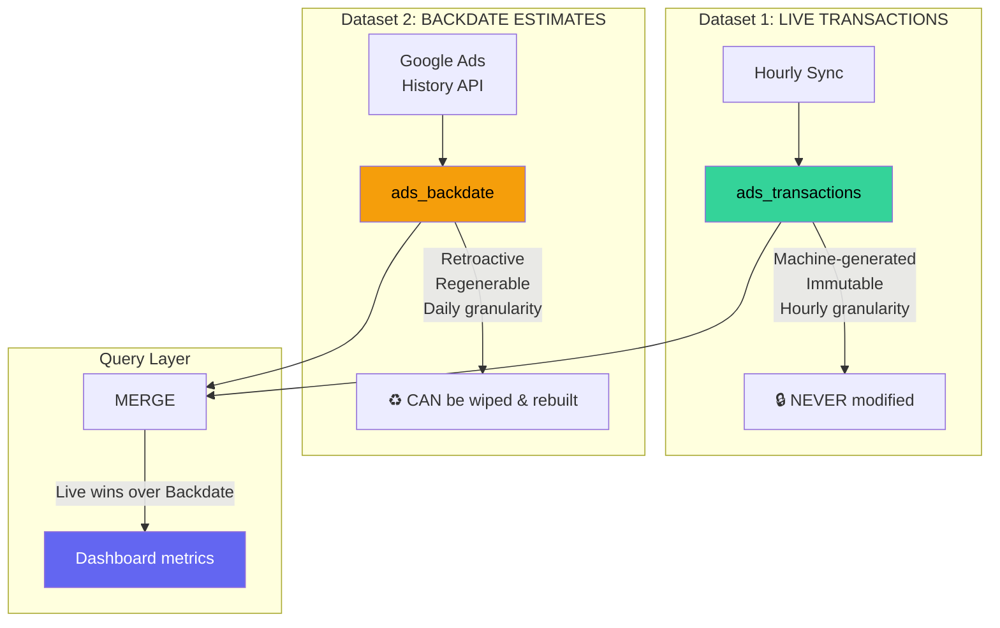

# Two-Dataset Architecture: Live vs Backdate

## The Problem with One Table

Mixing live-synced data and retroactive backfill in the same table:

```
TX-001 | Day 1,  00:00 | Camp A | $180 | SYNC      ← live, hourly, reliable
TX-002 | Day 1,  01:00 | Camp A | $195 | SYNC      ← live, hourly, reliable
...
TX-700 | Day 1         | Camp A | $4,800 | BACKFILL ← daily, retroactive, estimated
```

Problems:
- **Which one do I trust?** Live TX-001 and backfill TX-700 both cover Day 1
- **Backfill based on current mapping** — if mapping changes, backfill is wrong but lives in same table as real data
- **Can't safely re-generate** backfill without risking live data
- **Different granularity** — hourly vs daily in one table = messy aggregation

## The Solution: Two Separate Datasets



| | Live Transactions | Backdate Estimates |
|---|---|---|
| **Source** | Hourly cron sync | Google Ads History API (pulled on mapping) |
| **Granularity** | Hourly | Daily |
| **Confidence** | 🟢 High — real-time, machine-generated | 🟡 Medium — retroactive, based on current mapping |
| **Mutability** | Immutable — never edit or delete | Regenerable — can wipe & rebuild |
| **Mapping change** | Stays untouched | **Wiped and regenerated** with new mapping |
| **Data starts flowing** | From campaign first sync | From Google Ads history (up to 2 years back) |
| **Lifespan** | Permanent | **Superseded** by live data over time |

---

## Data Models

### Dataset 1: Live Transactions (ads_transactions)

```typescript
interface AdsTransaction {
  id: string;                    // "TX-000142"
  timestamp: string;             // "2026-01-15T19:00:00Z" (precise hour)
  syncBatchId: string;           // groups all tx from same sync cycle

  // Source
  campaignId: string;
  campaignName: string;          // snapshot at sync time
  accountId: string;

  // Destination (null if unattributed at sync time)
  refLinkId: string | null;
  projectId: string | null;

  // Amounts
  cost: number;
  clicks: number;
  impressions: number;
  conversions: number;

  // Type
  type: "SYNC" | "ADJUSTMENT";
  adjustsTransactionId?: string; // for corrections
  note?: string;
}
```

### Dataset 2: Backdate Estimates (ads_backdate)

```typescript
interface AdsBackdateEntry {
  id: string;                    // "BD-000042"
  date: string;                  // "2026-01-15" (daily only, no hour)
  generatedAt: string;           // when this estimate was created

  // Source
  campaignId: string;

  // Destination (always set — generated from current mapping)
  refLinkId: string;
  projectId: string;

  // Amounts (daily totals from Google Ads History API)
  cost: number;
  clicks: number;
  impressions: number;
  conversions: number;

  // Metadata
  mappingSnapshot: {             // records WHICH mapping was used to generate this
    refLinkId: string;
    projectId: string;
    mappedAt: string;            // when the user created this mapping
  };
}
```

---

## Lifecycle — Full Worked Example

### Phase 1: Day 1–29 — Sync running, no mapping yet

```
LIVE TRANSACTIONS (flowing hourly):
TX-001 | Day 1,  00:00 | Camp A | project: null | $180 | SYNC
TX-002 | Day 1,  01:00 | Camp A | project: null | $195 | SYNC
...
TX-696 | Day 29, 23:00 | Camp A | project: null | $175 | SYNC

BACKDATE TABLE: (empty — no mapping, nothing to backdate)

DASHBOARD: "⚠️ Camp A: $125K chi phí chưa gán"
```

### Phase 2: Day 30 — User maps Campaign A → Binance

**Two things happen:**

**Step 1**: Future live transactions get attributed automatically
```
TX-697 | Day 30, 00:00 | Camp A | Binance | $190 | SYNC  ← attributed from now on
```

**Step 2**: Past UNATTRIBUTED live transactions get re-attributed
```
TX-001 | Day 1,  00:00 | Camp A | Binance | $180 | SYNC  ← was null, now Binance
TX-002 | Day 1,  01:00 | Camp A | Binance | $195 | SYNC
... (all 696 transactions updated)
```

**NO backdate needed** — we already have hourly live data for Day 1-29!

```
BACKDATE TABLE: (still empty — live data covers everything)
```

### Phase 3: Day 30 — BUT what if Campaign A ran for 6 months before our sync started?

System started syncing on Day 1, but Campaign A has been running on Google Ads since **6 months ago** (Day -180).

**Now backdate kicks in:**

```
System pulls Google Ads History API for Camp A: Day -180 → Day 0 (before our sync)

BACKDATE TABLE:
BD-001 | Day -180 | Camp A | Binance | $4,200 | (daily total)
BD-002 | Day -179 | Camp A | Binance | $4,500 |
BD-003 | Day -178 | Camp A | Binance | $3,800 |
...
BD-180 | Day 0    | Camp A | Binance | $4,100 |

LIVE TRANSACTIONS: Day 1 → Day 30 (hourly, attributed to Binance)

Dashboard sees: 210 days of data total
  - 180 days from backdate (daily) 🟡
  - 30 days from live (hourly) 🟢
```

### Phase 4: Day 60 — User remaps Campaign A → Kling

**Live data:**
```
Day 1-59 transactions stay at Binance (they were correctly attributed at sync time)
Day 60+ transactions go to Kling (new mapping)
```

**Backdate data:**
```
❗ Backdate was generated with "Binance" mapping.
   Now that mapping changed → WIPE and REGENERATE:

BD-001 | Day -180 | Camp A | Kling | $4,200 | (regenerated with new mapping!)
BD-002 | Day -179 | Camp A | Kling | $4,500 |
...
BD-180 | Day 0    | Camp A | Kling | $4,100 |
```

Wait — **should pre-system backdate go to Kling?** The campaign existed before our system, we have no idea which project it served back then. The user is saying "from now on, map Camp A to Kling" — does that mean the historical data should also move?

**Answer: YES, because backdate is an estimation.** It's based on the CURRENT mapping. When mapping changes, the estimation changes. This is the whole point of separating it from live data.

```
POST-REMAP STATE:

LIVE TRANSACTIONS (UNTOUCHED):
  Day 1-59:  Camp A → Binance   (these are FACTS — actually synced during Binance era)
  Day 60+:   Camp A → Kling     (new mapping)

BACKDATE (REGENERATED):
  Day -180 to Day 0: Camp A → Kling  (estimation — uses current mapping)
```

**This creates a natural "break" in the data:**

```
Binance dashboard:
  Day -180 to 0:  NO data (backdate moved to Kling)
  Day 1 to 59:    ✅ from live transactions
  Day 60+:        NO data (remapped to Kling)

Kling dashboard:
  Day -180 to 0:  ✅ from backdate (estimated)
  Day 1 to 59:    NO data (live transactions belong to Binance)
  Day 60+:        ✅ from live transactions
```

### Phase 5: Over time — backdate gets superseded

As months pass, we accumulate more and more live data. The backdate becomes less relevant:

```
Month 1:   ██░░░░░░░░░░░░░░   live 30 days, backdate 180 days
Month 3:   ██████░░░░░░░░░░   live 90 days, backdate 180 days
Month 6:   ████████████░░░░   live 180 days, backdate 180 days
Month 12:  ████████████████   live 360 days → backdate fully superseded!
```

Eventually the backdate period falls outside any reasonable date range query and becomes irrelevant.

---

## Query Pattern: Overlay Merge

```
For each date D in query range:

1. Does LIVE data exist for date D?
   → YES: use live transactions (SUM grouped by date)
   → NO:  continue to step 2

2. Does BACKDATE exist for date D?
   → YES: use backdate entry
   → NO:  no data for this date
```

```sql
-- Overlay query: live wins over backdate
WITH live AS (
  SELECT
    DATE(timestamp) as date,
    SUM(cost) as cost,
    SUM(clicks) as clicks,
    'live' as source
  FROM ads_transactions
  WHERE projectId = 'proj-binance'
    AND timestamp BETWEEN '2026-01-01' AND '2026-03-31'
  GROUP BY DATE(timestamp)
),
backdate AS (
  SELECT
    date,
    SUM(cost) as cost,
    SUM(clicks) as clicks,
    'backdate' as source
  FROM ads_backdate
  WHERE projectId = 'proj-binance'
    AND date BETWEEN '2026-01-01' AND '2026-03-31'
  GROUP BY date
)
SELECT
  COALESCE(live.date, backdate.date) as date,
  COALESCE(live.cost, backdate.cost) as cost,
  COALESCE(live.clicks, backdate.clicks) as clicks,
  CASE WHEN live.date IS NOT NULL THEN 'live' ELSE 'backdate' END as source
FROM live
FULL OUTER JOIN backdate ON live.date = backdate.date
ORDER BY date
```

---

## Dashboard Trust Indicators

The dashboard shows WHERE the data comes from:

```
┌──────────────────────────────────────────────────────────────┐
│  📊 Từ Google Ads  (1 campaign, 60 ngày dữ liệu)            │
│                                                              │
│  ┌──────────────────────────────────────────────────────┐    │
│  │ 🟢 30 ngày dữ liệu trực tiếp (hourly sync)         │    │
│  │ 🟡 30 ngày dữ liệu ước tính (backdate từ Ads API)  │    │
│  └──────────────────────────────────────────────────────┘    │
│                                                              │
│  ┌──────────────┐ ┌──────────────┐ ┌──────────────┐          │
│  │ Tổng chi phí │ │ Tổng clicks  │ │ Tổng impr.   │          │
│  │ $258K        │ │ 24.8K        │ │ 680K         │          │
│  └──────────────┘ └──────────────┘ └──────────────┘          │
└──────────────────────────────────────────────────────────────┘
```

On the chart, backdate period has a different visual treatment:

```
Cost (VND)
  $6,000 ┤
         │   Backdate (🟡)          Live (🟢)
  $5,000 ┤┄┄┄┄╮┄┄╮┄┄╮┄┄╮┄┄╮▓▓▓▓╮▓▓╮▓▓╮▓▓╮▓▓╮▓▓╮▓▓╮▓▓╮▓▓╮▓▓
         │    ╰┄┄╯┄┄╯┄┄╯┄┄╯     ╰▓▓╯▓▓╯▓▓╯▓▓╯▓▓╯▓▓╯▓▓╯▓▓╯
  $4,000 ┤                 │
         │   ┄┄ dashed     │    ▓▓ solid
  $3,000 ┤   (estimated)   │    (actual)
         │                 │
     $0  ┼──┬──┬──┬──┬──┬──┼──┬──┬──┬──┬──┬──┬──┬──┬──┬──
         -30  -25  -20  -15│ -10  -5   0   5  10  15  20  25  Day
                            │
                     First sync day
```

---

## Summary: Why Two Datasets > One

| Scenario | One table (mixed) | Two datasets (separated) |
|----------|-------------------|-------------------------|
| "Is this data real or estimated?" | Check `type` field — janky | Check which table — clear |
| Mapping changes | Edit BACKFILL rows in same table as SYNC | Wipe backdate table, regenerate. Live untouched |
| "Show me only reliable data" | `WHERE type = 'SYNC'` — filter | Query only `ads_transactions` — clean |
| Data quality audit | Mixed confidence in one table | Separate confidence levels by design |
| Backdate conflicts with live | Two rows for same date, which wins? | Overlay merge: live always wins |
| Storage/retention policy | Same policy for all | Different retention: live = permanent, backdate = purgeable |
