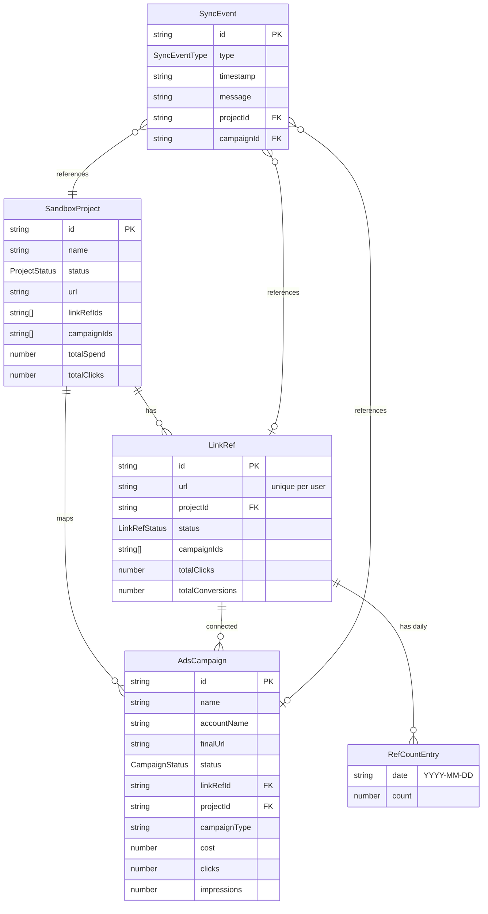

# PRD: Quản Lý Dự Án (Project Management)

> **Module**: Project Management  
> **App**: Adecos  
> **Author**: Auto-generated from Sandbox + Production codebase analysis  
> **Date**: 2026-04-29  
> **Status**: Ready for Dev Handoff

---

## Executive Summary

Module Quản Lý Dự Án cho phép người dùng quản lý toàn bộ vòng đời dự án affiliate: từ tạo dự án, nhập thông tin chính sách hoa hồng, theo dõi traffic, đến kết nối Campaign Google Ads với Link Ref tracking và phân tích hiệu quả quảng cáo. Module bao gồm 2 môi trường: **Production** (dữ liệu thật, API backend) và **Sandbox** (prototype với mock data và kịch bản mô phỏng).

---

## Table of Contents

1. [Screen 1: Danh sách Dự án (Production)](#screen-1-danh-sách-dự-án-production)
2. [Screen 2: Modal Thêm/Sửa Dự án](#screen-2-modal-thêmsửa-dự-án)
3. [Screen 3: Chi tiết Dự án – Tab Thông tin (Production)](#screen-3-chi-tiết-dự-án--tab-thông-tin-production)
4. [Screen 4: Chi tiết Dự án – Tab Traffic (Production)](#screen-4-chi-tiết-dự-án--tab-traffic-production)
5. [Screen 5: Sandbox – Danh sách Dự án & Kết nối Campaign](#screen-5-sandbox--danh-sách-dự-án--kết-nối-campaign)
6. [Screen 6: Sandbox – Chi tiết Dự án (4 sub-tabs)](#screen-6-sandbox--chi-tiết-dự-án-4-sub-tabs)
   - [6A: Tab Hiệu quả Ads](#6a-tab-hiệu-quả-ads)
   - [6B: Tab Kết nối Báo cáo](#6b-tab-kết-nối-báo-cáo)
   - [6C: Tab Phân tích Dự án](#6c-tab-phân-tích-dự-án)
   - [6D: Tab Lịch sử Dự án](#6d-tab-lịch-sử-dự-án)

---

## Screen 1: Danh sách Dự án (Production)

**Route**: `/projects`  
**Component**: [page.tsx](file:///c:/Users/Admin/Desktop/adecosProjectProPrototype/src/app/%5Blocale%5D/%28admin%29/projects/page.tsx)

### 1.1 Problem

Người dùng cần một nơi tập trung để xem, tìm kiếm, lọc, và quản lý tất cả dự án affiliate. Khi chưa có dự án, cần CTA rõ ràng hướng dẫn tạo dự án hoặc sử dụng AI Agent.

### 1.2 Current Situation

- Trang hiển thị danh sách dự án dạng **Table** (mặc định) hoặc **Grid** (toggle).
- Hỗ trợ **search** theo keyword (query param `q`), lọc theo `industry`, `niche`, `status`, `progress`.
- **Server-side pagination** với page size configurable.
- Nút **"Thêm dự án"** mở modal `AddProjectModal`.
- Nút **"Xóa dự án"** (batch) khi chọn nhiều dòng.
- **Column config** cho phép ẩn/hiện cột.
- **Empty state** hiển thị CTA "Tạo dự án" + "Chat với AI Agent".
- Fetch data từ API `useProjectInfoList`.

### 1.3 User Stories

| ID | User Story | Priority |
|----|-----------|----------|
| PL-01 | Là người dùng, tôi muốn xem danh sách tất cả dự án affiliate để có cái nhìn tổng quan | P0 |
| PL-02 | Là người dùng, tôi muốn tìm kiếm dự án theo tên, URL, ngành hàng để tìm nhanh dự án cần xem | P0 |
| PL-03 | Là người dùng, tôi muốn lọc dự án theo trạng thái và tiến độ để quản lý hiệu quả | P1 |
| PL-04 | Là người dùng, tôi muốn chuyển xem giữa Table ↔ Grid để chọn giao diện phù hợp | P2 |
| PL-05 | Là người dùng, tôi muốn ẩn/hiện cột trong bảng để chỉ xem thông tin cần thiết | P2 |
| PL-06 | Là người dùng, tôi muốn xóa nhiều dự án cùng lúc với confirm dialog để tránh xóa nhầm | P1 |
| PL-07 | Là người dùng mới, tôi muốn thấy hướng dẫn rõ ràng khi chưa có dự án nào | P1 |

### 1.4 Acceptance Criteria

- [ ] **AC-PL-01**: Bảng hiển thị đúng các cột: STT, Mảng, Dự án, Link, Hoa hồng, Trả thưởng, Lưu lượng tháng, Ngày cập nhật, Hành động
- [ ] **AC-PL-02**: Search bar cập nhật URL param `q`, trigger re-fetch API và reset page về 1
- [ ] **AC-PL-03**: Filter dropdown cho Status (`active`, `inactive`, `pending`, `suspended`) và Progress range hoạt động đúng
- [ ] **AC-PL-04**: Toggle view List ↔ Grid chuyển đổi mượt mà, giữ nguyên dữ liệu
- [ ] **AC-PL-05**: Column config popup cho phép Show/Hide từng cột, có nút "Reset" và "Select All"
- [ ] **AC-PL-06**: Chọn dự án → nút "Xóa N dự án" hiện → confirm dialog → gọi API `useDeleteProjects` → toast success → unselect
- [ ] **AC-PL-07**: Khi `isError` hoặc danh sách rỗng → hiển thị empty state với icon + CTA "Tạo dự án" (mở modal) + "Chat với AI Agent" (redirect `/chat?new=1`)
- [ ] **AC-PL-08**: Pagination: nút phân trang, thay đổi page size (10/20/50/100), hiển thị "Trang X/Y"

### 1.5 Test Cases

| TC-ID | Test Case | Steps | Expected |
|-------|-----------|-------|----------|
| TC-PL-01 | Load trang danh sách rỗng | Login → Navigate `/projects` khi chưa có dự án nào | Hiển thị empty state, CTA "Tạo dự án" và "Chat với AI Agent" visible |
| TC-PL-02 | Search dự án | Nhập "Binance" vào search bar | URL thêm `?q=Binance`, bảng chỉ hiển thị dự án match, page reset về 1 |
| TC-PL-03 | Lọc theo status | Chọn filter Status = "Đang hoạt động" | Bảng chỉ hiển thị dự án có status `active` |
| TC-PL-04 | Toggle view mode | Click icon Grid | Giao diện chuyển sang Grid cards, dữ liệu giống nhau |
| TC-PL-05 | Ẩn cột | Mở Column config → uncheck "Hoa hồng" | Cột "Hoa hồng" biến mất khỏi bảng |
| TC-PL-06 | Xóa batch dự án | Check 3 dự án → Click "Xóa 3 dự án" → Confirm | 3 dự án bị xóa, toast hiện, checkbox reset |
| TC-PL-07 | Pagination | Navigate đến page 2 → thay page size thành 20 | Trang reset về 1, hiển thị 20 items/page |
| TC-PL-08 | Error state | Simulate API error (500) | Hiển thị empty state với message lỗi |

---

## Screen 2: Modal Thêm/Sửa Dự án

**Component**: [AddProjectModal.tsx](file:///c:/Users/Admin/Desktop/adecosProjectProPrototype/src/containers/projects/AddProjectModal.tsx)

### 2.1 Problem

Người dùng cần nhập đầy đủ thông tin dự án affiliate theo 4 nhóm: thông tin cơ bản, hoa hồng, traffic, và chính sách. Modal cần hỗ trợ cả chế độ Thêm mới và Chỉnh sửa.

### 2.2 Current Situation

- Modal form `SimpleModal` với 4 sections: **Thông tin cơ bản**, **Thông tin hoa hồng**, **Thông tin traffic**, **Chính sách chi tiết**.
- Chế độ Edit: load data từ API `useAgentProjectDetail(editProjectId)` → fill form.
- Validation client-side: name required (max 255), URL required (max 2048), numbers non-negative, commission_min ≤ commission_max.
- Policy details: toggle checkbox "Có chính sách chi tiết" → reveal sub-form (note, rate, type, unit, evidence URLs, extra JSON).
- Submit: gọi `useCreateProject` hoặc `useUpdateProject`.

### 2.3 User Stories

| ID | User Story | Priority |
|----|-----------|----------|
| AP-01 | Là người dùng, tôi muốn tạo dự án mới với thông tin cơ bản (tên, URL, ngành, mô tả, trạng thái) | P0 |
| AP-02 | Là người dùng, tôi muốn nhập thông tin hoa hồng (loại, min, max, đơn vị) | P0 |
| AP-03 | Là người dùng, tôi muốn nhập thông tin traffic (lượt truy cập/tháng, tổng traffic, tháng đo) | P1 |
| AP-04 | Là người dùng, tôi muốn nhập chính sách chi tiết (ghi chú, rate, loại, đơn vị, bằng chứng URL) | P1 |
| AP-05 | Là người dùng, tôi muốn chỉnh sửa dự án đã tạo với dữ liệu tự động fill vào form | P0 |
| AP-06 | Là người dùng, tôi muốn thấy validation errors rõ ràng khi nhập sai | P0 |

### 2.4 Acceptance Criteria

- [ ] **AC-AP-01**: Form hiển thị 4 sections rõ ràng với header styled
- [ ] **AC-AP-02**: Trường `name` và `url` bắt buộc — form không submit nếu thiếu, hiện error message
- [ ] **AC-AP-03**: `commission_min > commission_max` → hiện error "Tỷ lệ tối đa phải ≥ tỷ lệ tối thiểu"
- [ ] **AC-AP-04**: Checkbox "Có chính sách chi tiết" toggle → hiện/ẩn sub-form chính sách
- [ ] **AC-AP-05**: Evidence sections (Trụ sở, Ghi chú, Tỷ lệ) mỗi section có URL + textarea mô tả
- [ ] **AC-AP-06**: Extra JSON field validates là JSON object hợp lệ
- [ ] **AC-AP-07**: Khi edit → modal title "Chỉnh sửa dự án", nút "Lưu thay đổi"; form auto-fill từ API
- [ ] **AC-AP-08**: Loading state khi đang fetch detail (edit mode) hoặc submitting
- [ ] **AC-AP-09**: Cancel → reset form về default values, đóng modal
- [ ] **AC-AP-10**: Status dropdown: 4 options (Đang hoạt động / Tạm dừng / Chờ duyệt / Bị đình chỉ)

### 2.5 Test Cases

| TC-ID | Test Case | Steps | Expected |
|-------|-----------|-------|----------|
| TC-AP-01 | Tạo dự án thành công | Fill tên + URL + ngành → Submit | API `POST` → modal đóng → dự án mới hiện trong list |
| TC-AP-02 | Validation required | Bỏ trống tên, nhấn Submit | Error message "Tên dự án là bắt buộc" hiện dưới input |
| TC-AP-03 | Commission range validation | Nhập min = 20, max = 10 → Submit | Error "Tỷ lệ tối đa phải ≥ tỷ lệ tối thiểu" |
| TC-AP-04 | Toggle chính sách | Check "Có chính sách chi tiết" | Sub-form chính sách expand với animation |
| TC-AP-05 | Invalid JSON | Nhập `[1,2,3]` vào Extra JSON → Submit | Error "JSON bổ sung phải là object hợp lệ" |
| TC-AP-06 | Edit mode load | Click "Edit" trên dự án có sẵn | Modal mở, form auto-fill đúng dữ liệu từ API |
| TC-AP-07 | URL max length | Nhập URL > 2048 ký tự → Submit | Error "URL tối đa 2048 ký tự" |
| TC-AP-08 | Negative number | Nhập monthly_visits = -100 | Error "Giá trị phải ≥ 0" |

---

## Screen 3: Chi tiết Dự án – Tab Thông tin (Production)

**Route**: `/projects/[id]?tab=info` (default)  
**Components**: [ProjectDetailLayout.tsx](file:///c:/Users/Admin/Desktop/adecosProjectProPrototype/src/containers/project-detail/ProjectDetailLayout.tsx), [ProjectInfoContent.tsx](file:///c:/Users/Admin/Desktop/adecosProjectProPrototype/src/containers/project-detail/ProjectInfoContent.tsx)

### 3.1 Problem

Người dùng cần xem chi tiết đầy đủ một dự án: mô tả, thông tin chung, và chính sách hoa hồng/trả thưởng/điều kiện. Data phải parse được từ `policy_details` JSON phức tạp.

### 3.2 Current Situation

- Layout 2 tabs: **Thông tin dự án** (default), **Chỉ số traffic**.
- Tab Thông tin gồm 3 sections: **Giới thiệu**, **Thông tin chung** (11 fields), **Chính sách** (3 cards).
- Chính sách parse từ `policy_details` object: hoa hồng (loại, tóm tắt, bonus, recurring), trả thưởng (deadline, time, minimum, tracking, payment methods), cấm (ads, brand name, ad limits, cancel conditions).
- Data fetch từ `useAgentProjectDetail`.

### 3.3 User Stories

| ID | User Story | Priority |
|----|-----------|----------|
| PI-01 | Là người dùng, tôi muốn xem mô tả tổng quan dự án | P0 |
| PI-02 | Là người dùng, tôi muốn xem thông tin chung (tên, URL, trạng thái, kỳ dữ liệu, traffic, nguồn, mảng, ngách) | P0 |
| PI-03 | Là người dùng, tôi muốn xem chính sách hoa hồng (loại, tỷ lệ, bonus, recurring) | P0 |
| PI-04 | Là người dùng, tôi muốn xem chính sách trả thưởng (deadline, minimum payout, payment methods) | P1 |
| PI-05 | Là người dùng, tôi muốn xem điều kiện cấm (ADS, brand name, giới hạn, điều kiện hủy) | P1 |

### 3.4 Acceptance Criteria

- [ ] **AC-PI-01**: Header hiển thị tên dự án, ngày tạo, ngày cập nhật
- [ ] **AC-PI-02**: Tab navigation giữa "Thông tin dự án" ↔ "Chỉ số traffic" cập nhật URL param `tab`
- [ ] **AC-PI-03**: Section "Giới thiệu" hiển thị mô tả dự án full text
- [ ] **AC-PI-04**: Section "Thông tin chung" hiển thị 11 fields trong grid 2 columns
- [ ] **AC-PI-05**: Mỗi Field hiển thị label + value trong bordered input-like box
- [ ] **AC-PI-06**: URL field có icon `ExternalLink` clickable → mở tab mới
- [ ] **AC-PI-07**: 3 Policy Cards (Hoa hồng, Trả thưởng, Cấm & điều kiện) hiển thị grid 3 columns
- [ ] **AC-PI-08**: Policy items hiển thị dạng label-value với dot indicator
- [ ] **AC-PI-09**: Lists (ad_limits, cancel_conds) render dạng bullet list
- [ ] **AC-PI-10**: Loading state hiển thị "Đang tải…"
- [ ] **AC-PI-11**: Error state hiển thị message lỗi trong bordered box

### 3.5 Test Cases

| TC-ID | Test Case | Steps | Expected |
|-------|-----------|-------|----------|
| TC-PI-01 | Load chi tiết dự án | Navigate `/projects/{id}` | Header hiển thị tên, tabs visible, info tab active |
| TC-PI-02 | Dự án có đầy đủ policy | Load dự án có `has_policy = true` | 3 policy cards hiển thị đầy đủ fields |
| TC-PI-03 | Dự án không có policy | Load dự án `has_policy = false` | Policy cards hiển thị "—" cho tất cả fields |
| TC-PI-04 | URL clickable | Click icon ExternalLink bên cạnh URL | Mở URL dự án trong tab mới |
| TC-PI-05 | Null/undefined fields | Dự án thiếu các trường optional | Hiển thị "—" thay vì crash |
| TC-PI-06 | Tab switch | Click tab "Chỉ số traffic" | URL cập nhật `?tab=traffic`, content chuyển |

---

## Screen 4: Chi tiết Dự án – Tab Traffic (Production)

**Route**: `/projects/[id]?tab=traffic`  
**Component**: [TrafficContent.tsx](file:///c:/Users/Admin/Desktop/adecosProjectProPrototype/src/containers/project-detail/TrafficContent.tsx)

### 4.1 Problem

Người dùng cần theo dõi dữ liệu traffic website từ SimilarWeb: tổng truy cập, bounce rate, trend theo tháng, social traffic distribution, và breakdown theo quốc gia.

### 4.2 Current Situation

- **Date range picker** cho phép filter theo khoảng thời gian.
- **6 KPI cards**: Tổng truy cập, Truy cập duy nhất, Truy cập trùng lặp, Số trang/visit, Thời lượng TB, Tỷ lệ thoát — mỗi card có change % vs tháng trước (TrendingUp/TrendingDown icon).
- **2 Charts**: Diễn biến lưu lượng (AreaChart), Social Traffic (BarChart phân bổ platform).
- **Country table**: DataTable với search, pagination, sortable columns (quốc gia, tổng truy cập, phân bổ, thời lượng, trang/visit, bounce rate).
- Data fetch từ `useAgentProjectDetail` → parse `traffic_details` (global, social, source, country).

### 4.3 User Stories

| ID | User Story | Priority |
|----|-----------|----------|
| PT-01 | Là người dùng, tôi muốn xem KPI tổng quan traffic tháng hiện tại + so sánh tháng trước | P0 |
| PT-02 | Là người dùng, tôi muốn xem biểu đồ diễn biến traffic theo thời gian | P0 |
| PT-03 | Là người dùng, tôi muốn xem phân bổ social traffic theo platform | P1 |
| PT-04 | Là người dùng, tôi muốn xem traffic breakdown theo quốc gia với search và sort | P1 |
| PT-05 | Là người dùng, tôi muốn filter traffic data theo khoảng thời gian | P2 |

### 4.4 Acceptance Criteria

- [ ] **AC-PT-01**: 6 KPI cards hiển thị grid 3 columns — mỗi card có: label, value (formatted number), change % với color coding (xanh = positive, đỏ = negative)
- [ ] **AC-PT-02**: Biểu đồ Trend sử dụng AreaChart (Recharts), responsive, hover tooltip
- [ ] **AC-PT-03**: Social Traffic chart hiển thị pie/bar phân bổ theo platform
- [ ] **AC-PT-04**: Country table columns: Quốc gia, Tổng truy cập, Phân bổ %, Thời lượng TB, Số trang/visit, Tỷ lệ thoát
- [ ] **AC-PT-05**: Country search filter real-time by country name, reset page
- [ ] **AC-PT-06**: Country table pagination: 10/20/50 per page
- [ ] **AC-PT-07**: Date range picker component at top right
- [ ] **AC-PT-08**: Bounce rate change color inverted (đỏ khi tăng = xấu)

### 4.5 Test Cases

| TC-ID | Test Case | Steps | Expected |
|-------|-----------|-------|----------|
| TC-PT-01 | Load traffic tab | Navigate `?tab=traffic` | 6 KPI cards hiển thị, 2 charts render, country table load |
| TC-PT-02 | KPI change positive | Traffic tháng này > tháng trước | TrendingUp icon xanh, % dương |
| TC-PT-03 | KPI change negative | Traffic tháng này < tháng trước | TrendingDown icon đỏ, % âm |
| TC-PT-04 | Country search | Nhập "Vietnam" | Bảng filter hiển thị chỉ Vietnam |
| TC-PT-05 | Country pagination | Dataset có 30 quốc gia, page size = 10 | 3 pages, navigation works |
| TC-PT-06 | No traffic data | Dự án không có traffic_details | Charts empty, KPIs show "0" |

---

## Screen 5: Sandbox – Danh sách Dự án & Kết nối Campaign

**Route**: `/projects/sandbox`  
**Components**: [ProjectListPanel.tsx](file:///c:/Users/Admin/Desktop/adecosProjectProPrototype/src/containers/project-sandbox/ProjectListPanel.tsx), [ConnectCampaignModal.tsx](file:///c:/Users/Admin/Desktop/adecosProjectProPrototype/src/containers/project-sandbox/ConnectCampaignModal.tsx), [MigrateCampaignModal.tsx](file:///c:/Users/Admin/Desktop/adecosProjectProPrototype/src/containers/project-sandbox/MigrateCampaignModal.tsx)

### 5.1 Problem

Người dùng cần một môi trường sandbox để test workflow quản lý dự án — campaign — link ref trước khi triển khai production. Cần khả năng tạo dự án, kết nối campaign Google Ads, xử lý dedup link ref, migrate campaign giữa projects, và simulate các edge cases.

### 5.2 Current Situation

#### 5.2.1 Project List (DataTable)

- Hiển thị danh sách dự án trong `DataTable` với columns: Select, STT, Dự án, Trạng thái, Campaign, Link Ref, Chi phí, Clicks, Cập nhật, Actions.
- **3 tabs filter**: Tất cả / Đang chạy / Đã lưu.
- **Actions per row**: "Connect" (mở ConnectCampaignModal) + "Xem" (navigate to detail).
- **Tạo dự án mới**: modal đơn giản (tên dự án → dispatch `CREATE_PROJECT`).
- **Scenario system**: `activeScenario` trigger auto-actions (e.g., connect campaigns, dedup, URL change, error cases).
- **Sync animation**: visual feedback khi scenario chạy.

#### 5.2.2 Connect Campaign Modal

- Shows all campaigns NOT in current project (unmapped + from other projects).
- **Grouped hierarchy**: Email → Account → Campaign.
- **Dedup preview**: campaigns sharing same `finalUrl` → auto-create 1 Link Ref.
- **Migration warning**: campaigns from other projects → amber warning → confirm dialog before proceed.
- **URL conflict detection**: link ref URL already in another project → red error.
- **Sync animation**: 4-step progress during connect process.
- Search filter: name, email, account ID, URL.
- Select all at Email/Account level.

#### 5.2.3 Migrate Campaign Modal

- Di chuyển campaign từ project A → project B.
- Input: target project (dropdown) + new affiliate URL.
- **Two-way sync**: gọi Google Ads API để override Final URL.
- URL conflict validation.
- Preview: source project → target project, old URL → new URL.
- Warning banner: Google Ads API rate limit + policy violation risk.

#### 5.2.4 Edit Link Ref Modal

- Sửa URL của Link Ref existing.
- **Two-way sync**: update Final URL cho tất cả campaigns mapped.
- Cross-project URL conflict validation.
- Preview: old URL → new URL + count campaigns affected.

### 5.3 User Stories

| ID | User Story | Priority |
|----|-----------|----------|
| SL-01 | Là người dùng, tôi muốn xem danh sách dự án sandbox với metrics tổng hợp | P0 |
| SL-02 | Là người dùng, tôi muốn lọc dự án theo trạng thái (tất cả/đang chạy/đã lưu) | P1 |
| SL-03 | Là người dùng, tôi muốn tạo dự án mới rỗng để làm "phễu" hứng campaign | P0 |
| SL-04 | Là người dùng, tôi muốn kết nối campaign Google Ads vào dự án | P0 |
| SL-05 | Là người dùng, tôi muốn hệ thống tự tạo Link Ref từ Final URL và dedup khi nhiều campaign cùng URL | P0 |
| SL-06 | Là người dùng, tôi muốn migrate campaign từ dự án này sang dự án khác | P1 |
| SL-07 | Là người dùng, tôi muốn hệ thống cảnh báo khi URL đã thuộc dự án khác | P0 |
| SL-08 | Là người dùng, tôi muốn sửa URL Link Ref và hệ thống tự sync qua Google Ads API | P1 |
| SL-09 | Là người dùng, tôi muốn xem animation đồng bộ khi kết nối/sync | P2 |
| SL-10 | Là người dùng, tôi muốn chọn campaign từ multi-level hierarchy (Email → Account → Campaign) | P1 |

### 5.4 Acceptance Criteria

#### Project List
- [ ] **AC-SL-01**: DataTable hiển thị 10 columns chính xác
- [ ] **AC-SL-02**: 3 tabs (Tất cả/Đang chạy/Đã lưu) filter đúng theo `status`
- [ ] **AC-SL-03**: Header hiện "N dự án · M campaign mapped"
- [ ] **AC-SL-04**: Nút "Thêm dự án" → modal → nhập tên → dispatch `CREATE_PROJECT` → toast success
- [ ] **AC-SL-05**: Row click "Xem" → navigate sang detail view (animated transition)

#### Connect Campaign Modal
- [ ] **AC-SL-06**: Modal hiển thị campaigns grouped Email → Account → Campaign
- [ ] **AC-SL-07**: Checkbox at Email/Account level → select/deselect all children
- [ ] **AC-SL-08**: Search filters campaign name, email, account, URL
- [ ] **AC-SL-09**: "Link Ref Preview" section hiển thị dedup result: N URL → M Link Ref
- [ ] **AC-SL-10**: Campaign đã dedup (cùng finalUrl) → show `(dedup: 1 Link Ref)` label
- [ ] **AC-SL-11**: Campaign from other project → amber warning "Đang thuộc dự án X — chọn sẽ migrate"
- [ ] **AC-SL-12**: URL conflict (link ref URL in another project) → red error banner
- [ ] **AC-SL-13**: Campaign không có finalUrl → amber warning "Không có URL trang đích" + auto-skip khi sync
- [ ] **AC-SL-14**: Sync animation: 4-step progress indicator
- [ ] **AC-SL-15**: Migration confirm dialog hiển thị danh sách campaigns sẽ bị migrate + source project

#### Migrate Campaign Modal
- [ ] **AC-SL-16**: Dropdown target project excludes current project + archived
- [ ] **AC-SL-17**: Input new affiliate URL + URL conflict validation real-time
- [ ] **AC-SL-18**: Preview section: source → target project, old → new URL
- [ ] **AC-SL-19**: Warning banner: "Google Ads API rate limit + policy violation risk"
- [ ] **AC-SL-20**: Sync dispatches: `ADD_EVENT(two_way_sync_triggered)` → `MIGRATE_CAMPAIGN`

#### Edit Link Ref Modal
- [ ] **AC-SL-21**: Hiển thị current URL + project name + campaign count
- [ ] **AC-SL-22**: New URL input + URL conflict check
- [ ] **AC-SL-23**: Preview: old URL → new URL + "N campaign sẽ được cập nhật"
- [ ] **AC-SL-24**: "Two-way Sync" warning banner
- [ ] **AC-SL-25**: Submit dispatches `EDIT_LINKREF` → toast success

### 5.5 Test Cases

| TC-ID | Test Case | Steps | Expected |
|-------|-----------|-------|----------|
| TC-SL-01 | Tạo dự án rỗng | Click "Thêm dự án" → nhập "Test Project" → Tạo | Dự án mới hiện trong bảng, status "Đã lưu", toast success |
| TC-SL-02 | Connect campaign mới | Mở Connect modal → chọn 2 campaigns cùng URL → Sync | 1 Link Ref tạo (dedup), 2 campaigns mapped, project status → "Đang chạy" |
| TC-SL-03 | Connect campaign từ project khác | Chọn campaign đang thuộc Project A | Amber warning hiện → Click Sync → Confirm migrate → Campaign chuyển sang |
| TC-SL-04 | URL conflict block | Chọn campaign có URL trùng với project khác | Red error "URL đã thuộc X", campaign bị skip |
| TC-SL-05 | Campaign không có URL | Chọn campaign final_url trống → Sync | Campaign bị skip, toast warning "Campaign không có Landing Page" |
| TC-SL-06 | Migrate campaign | Mở Migrate modal → chọn target project + new URL → Migrate | Campaign chuyển project, 3-step sync animation, events logged |
| TC-SL-07 | Edit Link Ref | Mở Edit modal → nhập URL mới → Lưu & Sync | Link Ref URL update, all mapped campaigns updated, Two-way sync event |
| TC-SL-08 | Edit Link Ref URL conflict | Nhập URL đã thuộc project khác | Red error hiện, nút Submit disabled |
| TC-SL-09 | Tab filter | Click "Đang chạy" tab | Bảng chỉ hiển thị dự án status "running" |
| TC-SL-10 | Search campaign in modal | Mở Connect → nhập email pattern | Chỉ campaigns matching email hiện |

---

## Screen 6: Sandbox – Chi tiết Dự án (4 sub-tabs)

**Component**: [SandboxDetailView.tsx](file:///c:/Users/Admin/Desktop/adecosProjectProPrototype/src/containers/project-sandbox/SandboxDetailView.tsx)

**Tab navigation**: Hiệu quả Ads → Kết nối báo cáo → Phân tích Dự án → Lịch sử dự án

---

### 6A: Tab Hiệu quả Ads

### 6A.1 Problem

Người dùng cần phân tích hiệu quả quảng cáo Google Ads so với ref count (số lượng referral thực tế). Cần so sánh chi phí ads vs. ref generated, tính cost-per-ref, và xem trend theo thời gian.

### 6A.2 Current Situation

- **Date range picker** (Google Ads style): preset quickselects (Hôm nay, 7/14/30 ngày qua, Tháng này/trước, Tất cả) + dual calendar picker + Apply/Cancel.
- **6 KPI cards** (filtered by date range + period-over-period comparison):
  - Tổng chi phí (VND)
  - Tổng clicks  
  - Tổng impressions
  - **Tổng Ref Count** (highlight)
  - **Chi phí / Ref** (highlight, invertColor — lower = better)
  - **Tỷ lệ Click → Ref** (highlight, percentage points)
- **2 dual-axis charts**:
  - Chi phí Ads vs Ref Count (Area, custom tooltip with cost/ref)
  - Impressions vs Clicks (Area, custom tooltip with CTR)
- **Ref Count per Link Ref table**: breakdown per link ref URL, showing total + last 7 days
- **Campaign performance table**: per-campaign name/status/cost/clicks/CTR/conversions

### 6A.3 User Stories

| ID | User Story | Priority |
|----|-----------|----------|
| SA-01 | Là người dùng, tôi muốn chọn khoảng thời gian để phân tích hiệu quả ads | P0 |
| SA-02 | Là người dùng, tôi muốn xem KPI tổng hợp (chi phí, clicks, impressions, ref count) với so sánh kỳ trước | P0 |
| SA-03 | Là người dùng, tôi muốn xem chi phí cho 1 referral (cost per ref) để đánh giá ROI | P0 |
| SA-04 | Là người dùng, tôi muốn xem biểu đồ dual-axis: chi phí vs ref count theo ngày | P0 |
| SA-05 | Là người dùng, tôi muốn xem impressions vs clicks + CTR theo ngày | P1 |
| SA-06 | Là người dùng, tôi muốn xem ref count breakdown theo từng Link Ref | P1 |
| SA-07 | Là người dùng, tôi muốn xem hiệu quả từng campaign (cost, clicks, CTR, conversions) | P1 |

### 6A.4 Acceptance Criteria

- [ ] **AC-SA-01**: Date range picker mặc định "30 ngày qua", SSR-safe (init trong useEffect)
- [ ] **AC-SA-02**: 8 preset options: Hôm nay, Hôm qua, 7/14/30 ngày qua, Tháng này, Tháng trước, Tất cả
- [ ] **AC-SA-03**: Calendar: 2 months side-by-side, dropdown year/month selection
- [ ] **AC-SA-04**: Apply/Cancel buttons — draft state until apply
- [ ] **AC-SA-05**: KPI cards: 6 cards in 3-column grid; highlight cards have `border-primary/20 bg-primary/5`
- [ ] **AC-SA-06**: Period-over-period: show `↑ +X% vs trước` or `↓ -X% vs trước`
- [ ] **AC-SA-07**: Cost/Ref card: `invertColor = true` (green when decrease = cheaper)
- [ ] **AC-SA-08**: Click→Ref card: percentage points change (`pp`), not percent
- [ ] **AC-SA-09**: Cost vs Ref chart: dual Y-axis, custom tooltip showing "Chi phí / 1 ref"
- [ ] **AC-SA-10**: Imp vs Clicks chart: dual Y-axis, custom tooltip showing CTR
- [ ] **AC-SA-11**: Ref Count table: link ref URL + total + last 7 days columns
- [ ] **AC-SA-12**: Campaign table: name/status indicator/cost/clicks/CTR/conversions

### 6A.5 Test Cases

| TC-ID | Test Case | Steps | Expected |
|-------|-----------|-------|----------|
| TC-SA-01 | Default date range | Mở tab Hiệu quả Ads | Date range picker hiển thị "30 ngày qua", KPIs populated |
| TC-SA-02 | Preset selection | Mở picker → click "7 ngày qua" → Apply | Data filter 7 days, KPIs + charts update |
| TC-SA-03 | Custom date range | Mở picker → chọn ngày trên calendar → Apply | Data filter theo custom range |
| TC-SA-04 | Cancel draft | Mở picker → chọn ngày → Hủy | Picker đóng, date range không đổi |
| TC-SA-05 | Period comparison | Date range = 30 days | KPI cards hiển thị comparison vs 30 days trước |
| TC-SA-06 | Cost/ref invertColor | Cost/ref giảm so với kỳ trước | Arrow ↓ hiển thị màu xanh (tốt hơn) |
| TC-SA-07 | Chart tooltip | Hover lên Cost vs Ref chart | Tooltip hiện: Chi phí, Ref Count, Chi phí/1 ref |
| TC-SA-08 | No data | Dự án không có link ref hoặc campaign | KPIs show "—", charts hidden |

---

### 6B: Tab Kết nối Báo cáo

### 6B.1 Problem

Người dùng cần quản lý mối liên hệ Campaign ↔ Link Ref: xem visual connections, đồng bộ campaign, nhập ref count hàng ngày (manual + CSV), theo dõi chi tiết ref count per link ref.

### 6B.2 Current Situation

- **Two-column layout** with SVG connection lines:
  - **Left**: Campaigns list (sorted by linkRef position to minimize crossing lines)
  - **Right**: Link Refs list
- **SVG Bezier curves** vẽ từ campaign card → link ref card (color coded by link ref)
- **Search bar**: filter cả campaigns và link refs
- **Campaign card**: name, status badge, account name, final URL, metrics (cost, clicks, CTR), action buttons (Tải lại / Ngắt)
- **Tải lại (Sync)**: per-campaign refresh button — simulate API sync, 3 states (idle → loading → synced)
- **Ngắt (Disconnect)**: remove campaign from project/link ref
- **Link Ref card**: URL + copy/edit, stats (clicks, conversions, ref count, campaign count), connected campaigns list
- **Inline Ref Count Input**: 7 ngày gần nhất — number inputs per day, auto-save on blur/Enter, green checkmark feedback
- **CSV Import**: per link ref, parse `date,count` format, validate `YYYY-MM-DD`
- **Ref Count Detail Table**: paginated modal (20/page) with date filter (from/to), editable cells, percentage column
- **Add Link Ref modal**: manual link ref creation (URL input)
- **Connect Campaign modal**: embedded (same as Screen 5)
- **Edit Link Ref modal**: embedded (same as Screen 5)

### 6B.3 User Stories

| ID | User Story | Priority |
|----|-----------|----------|
| SC-01 | Là người dùng, tôi muốn xem visual mapping giữa campaigns và link refs bằng đường nối | P0 |
| SC-02 | Là người dùng, tôi muốn đồng bộ (refresh) campaign từ Google Ads | P1 |
| SC-03 | Là người dùng, tôi muốn ngắt kết nối campaign khỏi dự án | P0 |
| SC-04 | Là người dùng, tôi muốn nhập ref count hàng ngày cho mỗi link ref | P0 |
| SC-05 | Là người dùng, tôi muốn import ref count từ file CSV | P1 |
| SC-06 | Là người dùng, tôi muốn xem chi tiết ref count toàn bộ lịch sử (paginated, filterable) | P1 |
| SC-07 | Là người dùng, tôi muốn tạo link ref thủ công | P1 |
| SC-08 | Là người dùng, tôi muốn tìm kiếm campaign/link ref nhanh | P2 |
| SC-09 | Là người dùng, tôi muốn copy URL link ref nhanh | P2 |

### 6B.4 Acceptance Criteria

- [ ] **AC-SC-01**: Two-column grid layout (lg:grid-cols-2), campaign list sorted by linkRef position
- [ ] **AC-SC-02**: SVG connection bezier curves render correctly, recalculate on resize/scroll
- [ ] **AC-SC-03**: Line colors: 5 rotating colors, color per link ref group, dots at endpoints
- [ ] **AC-SC-04**: Campaign card: status dot (green=enabled, amber=paused, gray=other), metrics row, action buttons
- [ ] **AC-SC-05**: "Tải lại" button: 3 states — idle (RefreshCw icon) → loading (Loader2 spinning) → synced (Check icon green, auto-reset 3s)
- [ ] **AC-SC-06**: "Ngắt" button: dispatch `DISCONNECT_CAMPAIGN`, toast info
- [ ] **AC-SC-07**: Link Ref card: URL header with Copy/Edit buttons, stats row, connected campaigns list
- [ ] **AC-SC-08**: Inline ref count: 7 day inputs (grid-cols-7), date label (DD/MM), today highlighted with ring
- [ ] **AC-SC-09**: Ref count save: onBlur or Enter → dispatch `ADD_REF_COUNTS`, green checkmark 1.2s
- [ ] **AC-SC-10**: CSV import: accept .csv/.xlsx/.xls/.tsv/.txt, parse `date,count`, validate date format
- [ ] **AC-SC-11**: CSV error: toast "Không tìm thấy dữ liệu hợp lệ. Định dạng: YYYY-MM-DD, count"
- [ ] **AC-SC-12**: Ref Count Detail modal: table with columns (#, Ngày, Ref Count editable, % Tổng)
- [ ] **AC-SC-13**: Detail modal pagination: 20/page, prev/next buttons
- [ ] **AC-SC-14**: Detail modal date filter: From/To inputs + "Xóa bộ lọc" button
- [ ] **AC-SC-15**: Add Link Ref modal: URL input + validate + dispatch `ADD_LINKREF`
- [ ] **AC-SC-16**: Search bar: filters campaigns (name, URL, account, email) + link refs (URL) simultaneously

### 6B.5 Test Cases

| TC-ID | Test Case | Steps | Expected |
|-------|-----------|-------|----------|
| TC-SC-01 | Connection lines render | Có 3 campaigns → 2 link refs | 3 bezier curves render, đúng color, dots visible |
| TC-SC-02 | Lines update on resize | Resize browser window | SVG lines recalculate positions |
| TC-SC-03 | Sync campaign | Click "Tải lại" on a campaign | Button → loading state → "Đã đồng bộ" green → reset 3s |
| TC-SC-04 | Disconnect campaign | Click "Ngắt" on a campaign | Campaign status → archived, removed from link ref, project updated |
| TC-SC-05 | Input ref count | Tab Kết nối → type "150" in today's input → press Enter | Green checkmark, value saved |
| TC-SC-06 | Ref count onBlur | Type number → click outside | Value saved automatically |
| TC-SC-07 | CSV import success | Upload file with 30 valid rows | Toast "Đã nhập 30 ngày ref count từ file" |
| TC-SC-08 | CSV import invalid | Upload file with bad format | Toast error "Không tìm thấy dữ liệu hợp lệ" |
| TC-SC-09 | Ref detail modal | Click "Xem tất cả (N ngày)" | Modal opens, table paginated, dates filterable |
| TC-SC-10 | Edit ref count in modal | Click on count value → edit → Enter | Value updates, green checkmark |
| TC-SC-11 | Add link ref | Click "Thêm Link Ref" → enter URL → Tạo | New link ref appears, event logged |
| TC-SC-12 | Add duplicate link ref | Enter URL that already exists | Validation error event, toast "URL đã tồn tại" |
| TC-SC-13 | Search filter | Type "binance" in search | Only campaigns/linkRefs matching "binance" shown |
| TC-SC-14 | Copy link ref URL | Click "Copy" on link ref | URL copied to clipboard, toast "Đã copy" |
| TC-SC-15 | Empty campaign state | Project with 0 campaigns | Dashed border card "Chưa có Campaign" |

---

### 6C: Tab Phân tích Dự án

### 6C.1 Problem

Người dùng cần xem phân tích traffic website (SimilarWeb data) kết hợp với thông tin dự án (mô tả, chính sách) trong sandbox context.

### 6C.2 Current Situation

- **SimilarWeb section**: 3 KPI cards (Tổng truy cập, Tháng hiện tại, Số tháng dữ liệu), 2 charts (Trend + Social Traffic)
- **Project info section**: mô tả dự án
- **Thông tin chung**: 8 fields grid (Dự án, URL, Trạng thái, Campaigns, Link Refs, Tổng chi phí, Ngày tạo, Ngày cập nhật)
- **Chính sách**: 3 policy cards (Hoa hồng, Trả thưởng, Cấm & điều kiện) — hardcoded mock data

### 6C.3 User Stories

| ID | User Story | Priority |
|----|-----------|----------|
| SP-01 | Là người dùng, tôi muốn xem traffic trend và social distribution của dự án | P1 |
| SP-02 | Là người dùng, tôi muốn xem thông tin tổng quan (tên, URL, trạng thái, metrics) | P0 |
| SP-03 | Là người dùng, tôi muốn xem chính sách hoa hồng và trả thưởng | P1 |

### 6C.4 Acceptance Criteria

- [ ] **AC-SP-01**: Traffic section với BarChart3 icon header
- [ ] **AC-SP-02**: 3 KPI cards + 2 charts (TrafficTrendChart + SocialTrafficChart)
- [ ] **AC-SP-03**: Visit change %: so sánh last month vs previous month
- [ ] **AC-SP-04**: Project info fields in 2-column grid, URL field with ExternalLink icon
- [ ] **AC-SP-05**: 3 policy cards in 3-column grid (lg) — Hoa hồng, Trả thưởng, Cấm

### 6C.5 Test Cases

| TC-ID | Test Case | Steps | Expected |
|-------|-----------|-------|----------|
| TC-SP-01 | Load analysis tab | Click "Phân tích Dự án" tab | Traffic charts + info + policies render |
| TC-SP-02 | Project with known data | View "Binance" project | Specific mock data for Binance displays |
| TC-SP-03 | Unknown project | View project not in mock data | Falls back to `default` mock data |

---

### 6D: Tab Lịch sử Dự án

### 6D.1 Problem

Người dùng cần audit trail: xem mọi thay đổi đã xảy ra — tất cả campaigns liên quan (active + disconnected + archived) và timeline sự kiện.

### 6D.2 Current Situation

- **Campaign Summary Table**: list tất cả campaigns từng liên kết (current + từ events) — columns: Campaign name, Tài khoản, Trạng thái badge (Đang kết nối/Đã ngắt/Đã lưu trữ), Chi phí, Clicks, Số sự kiện.
- **Event Timeline**: vertical timeline với dot icons, mỗi event type có icon + color riêng:
  - `campaign_connected` → Zap (emerald)
  - `campaign_disconnected` → Unplug (destructive)
  - `campaign_migrated` → ArrowRightLeft (sky)
  - `linkref_created` → Link2 (violet)
  - `linkref_edited` → Pencil (amber)
  - `project_created` → Activity (primary)
  - `sync_completed` → Check (emerald)
  - `sync_error` → X (destructive)
- Events sorted newest first.
- Each event: badge label + timestamp + message + campaign info (name + account)

### 6D.3 User Stories

| ID | User Story | Priority |
|----|-----------|----------|
| SH-01 | Là người dùng, tôi muốn xem tất cả campaigns từng liên kết với dự án (cả đã disconnect) | P0 |
| SH-02 | Là người dùng, tôi muốn xem timeline sự kiện để audit trail | P0 |
| SH-03 | Là người dùng, tôi muốn phân biệt campaigns đang active vs disconnected vs archived | P1 |

### 6D.4 Acceptance Criteria

- [ ] **AC-SH-01**: Campaign summary table: columns chính xác (Campaign, Tài khoản, Trạng thái, Chi phí, Clicks, Sự kiện)
- [ ] **AC-SH-02**: Status badges: `completed` = Đang kết nối, `error` = Đã ngắt kết nối, `neutral` = Đã lưu trữ
- [ ] **AC-SH-03**: Status dot colors: green=active, red=disconnected, gray=archived
- [ ] **AC-SH-04**: Event timeline: vertical line on left, dot icons per event type
- [ ] **AC-SH-05**: 8 event types each with distinct icon + color
- [ ] **AC-SH-06**: Events sorted by timestamp descending (newest first)
- [ ] **AC-SH-07**: Each event shows: badge + date + message + optional campaign name/account
- [ ] **AC-SH-08**: Empty states: "Chưa có campaign nào" / "Chưa có sự kiện nào"

### 6D.5 Test Cases

| TC-ID | Test Case | Steps | Expected |
|-------|-----------|-------|----------|
| TC-SH-01 | Load history tab | Click "Lịch sử dự án" | Campaign table + event timeline render |
| TC-SH-02 | Campaign multi-status | Project có active + disconnected campaign | Table shows both with correct badges/colors |
| TC-SH-03 | Event timeline order | Multiple events at different times | Newest event at top |
| TC-SH-04 | Event types display | Connect → disconnect → reconnect sequence | 3 events with distinct icons/colors |
| TC-SH-05 | Empty history | Dự án mới, chưa có hoạt động | Both sections show empty messages |
| TC-SH-06 | Campaign detail in event | Event liên quan đến campaign | Campaign name + account name hiện dưới message |

---

## Data Model Reference

### Core Entities

### State Actions

| Action | Description | Dispatched From |
|--------|------------|-----------------|
| `CREATE_PROJECT` | Tạo dự án mới rỗng | Tạo dự án modal |
| `CONNECT_CAMPAIGNS` | Map campaigns → project, auto-create link refs | Connect modal |
| `DISCONNECT_CAMPAIGN` | Campaign → archived, remove from link ref | Ngắt button |
| `MIGRATE_CAMPAIGN` | Move campaign project A → B, update URLs | Migrate modal |
| `EDIT_LINKREF` | Change link ref URL, two-way sync campaigns | Edit modal |
| `ADD_LINKREF` | Manual link ref creation | Add Link Ref modal |
| `ADD_REF_COUNTS` | Add/update daily ref count entries | Inline input / CSV |
| `CAMPAIGN_URL_CHANGED_EXTERNAL` | External URL change detected | Sync scenario |
| `CAMPAIGN_STATUS_CHANGED_EXTERNAL` | External status change (removed/paused) | Sync scenario |
| `ADD_EVENT` | Log custom event | Various |

---

## Open Questions

> [!IMPORTANT]
> **For Product/Stakeholders:**
> 1. Sandbox hiện dùng **mock data** + **client-side state** (useReducer). Khi chuyển production, backend API design cho Campaign ↔ Link Ref mapping cần được finalize.
> 2. **Google Ads API integration** (two-way sync) cần confirm: rate limits, authentication flow, rollback strategy khi API fail.
> 3. **Ref Count nhập liệu**: production sẽ manual nhập + CSV hay có auto-import từ tracking system?
> 4. **Dedup logic**: khi 2 campaigns cùng Final URL, tự tạo 1 Link Ref. Edge case: URL thay đổi sau khi đã dedup?

> [!WARNING]
> **For Dev:**
> - Sandbox sử dụng `ProjectCampaignProvider` (React Context) — **KHÔNG** dùng backend API. Production cần migration plan.
> - SVG connection lines tính toán vị trí dựa trên `getBoundingClientRect()` — cần test trên nhiều screen size, scrollable containers.
> - Date range picker tránh SSR hydration mismatch bằng `useEffect` init.
