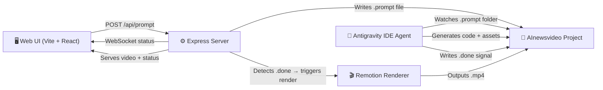

# Remotion Prompt Studio — Antigravity Integration

A web-based UI where you type a video prompt, Antigravity IDE processes the request (generating Remotion code, assets, voiceover), and the resulting video is rendered and displayed back in the UI.

## Architecture Overview

**Flow:**
1. User types prompt in the UI → hits "Generate"
2. Express server writes prompt to `AInewsvideo/.prompts/{id}.json`
3. Antigravity IDE (watching the AInewsvideo workspace) detects the new prompt file via a watcher skill
4. Antigravity's agent generates the Remotion composition code, voiceover scripts, fetches images, etc.
5. Agent writes a `.done` signal file when finished
6. Express server detects completion → triggers `npx remotion render` via `@remotion/renderer`
7. Rendered MP4 is served back to the UI for playback

## User Review Required

> [!IMPORTANT]
> **Integration model**: This design uses a **file-based handoff** between the web UI and Antigravity IDE. The UI writes a `.prompt` JSON file, and Antigravity reads it via a watcher skill. This is the most reliable approach given Antigravity's current architecture (no direct API endpoint). The alternative — using the `antigravity-sdk` — is community-maintained and less stable.

> [!WARNING]
> **Cloning the full `remotion-dev/remotion` monorepo is NOT recommended.** That's the framework's source code (~500+ packages). Instead, we'll initialize a fresh Remotion project in `c:\Users\ADMIN\Desktop\remotion` that reuses your proven patterns from AInewsvideo, with the added Prompt Studio UI layer on top. Your existing AInewsvideo project stays untouched as reference.

## Proposed Changes

### Component 1: Project Initialization

#### [NEW] `c:\Users\ADMIN\Desktop\remotion` — Fresh Remotion + Vite project

- Initialize a new Remotion project with `npx create-video@latest`
- Add a Vite-powered web UI layer for the Prompt Studio
- Copy proven patterns (skills, voiceover scripts, caption system) from AInewsvideo

---

### Component 2: Express Backend Server

#### [NEW] [server.ts](file:///c:/Users/ADMIN/Desktop/remotion/server/server.ts)
- Express + WebSocket server (runs on port 3001)
- `POST /api/prompt` — Receives prompt, writes `.prompts/{id}.json`, returns job ID
- `GET /api/jobs/:id` — Returns current status (queued → processing → rendering → done)
- `GET /api/jobs/:id/video` — Serves the rendered MP4
- `GET /api/jobs` — Lists all jobs with status
- WebSocket endpoint for real-time progress updates
- File watcher on `.prompts/` directory for `.done` signals
- Triggers `@remotion/renderer` `renderMedia()` when composition is ready

#### [NEW] [server/render.ts](file:///c:/Users/ADMIN/Desktop/remotion/server/render.ts)
- Wraps `@remotion/bundler` and `@remotion/renderer` 
- `renderVideo(compositionId, inputProps)` → outputs to `out/{id}.mp4`
- Progress callback for WebSocket streaming

---

### Component 3: Web UI (Prompt Studio)

#### [NEW] [src/ui/App.tsx](file:///c:/Users/ADMIN/Desktop/remotion/src/ui/App.tsx)
- Main Prompt Studio application
- Dark theme, glassmorphic design with premium aesthetics
- Three-panel layout:
  - **Left sidebar**: Job history list with status indicators
  - **Center**: Video player (`@remotion/player` for preview, native `<video>` for rendered output)
  - **Right sidebar**: Prompt input panel

#### [NEW] [src/ui/components/PromptPanel.tsx](file:///c:/Users/ADMIN/Desktop/remotion/src/ui/components/PromptPanel.tsx)
- Large textarea for video prompt
- Template selector dropdown (News Short, Documentary, AI Summary, Custom)
- "Generate" button with loading state
- Advanced options collapsible (voice ID, FPS, resolution, scene count)

#### [NEW] [src/ui/components/VideoPlayer.tsx](file:///c:/Users/ADMIN/Desktop/remotion/src/ui/components/VideoPlayer.tsx)
- Displays rendered MP4 video with custom controls
- Download button for the output
- Thumbnail generation for job history

#### [NEW] [src/ui/components/JobHistory.tsx](file:///c:/Users/ADMIN/Desktop/remotion/src/ui/components/JobHistory.tsx)
- List of past generation jobs
- Status badges: 🟡 Queued → 🔵 Processing → 🟠 Rendering → 🟢 Done → 🔴 Error
- Click to load video in player
- Timestamp + prompt preview

#### [NEW] [src/ui/components/StatusBar.tsx](file:///c:/Users/ADMIN/Desktop/remotion/src/ui/components/StatusBar.tsx)
- Real-time progress bar (WebSocket-driven)
- Step indicators: "Writing prompt → Agent processing → Generating assets → Rendering → Complete"
- Animated transitions between states

#### [NEW] [src/ui/index.css](file:///c:/Users/ADMIN/Desktop/remotion/src/ui/index.css)
- Premium dark theme design system
- CSS custom properties for color palette, spacing, typography
- Glassmorphism utilities
- Micro-animations for status transitions

#### [NEW] [src/ui/main.tsx](file:///c:/Users/ADMIN/Desktop/remotion/src/ui/main.tsx)
- Vite entry point for the UI app

#### [NEW] [ui.html](file:///c:/Users/ADMIN/Desktop/remotion/ui.html)
- HTML entry point for the Vite UI dev server

---

### Component 4: Antigravity Agent Skill

#### [NEW] [.agents/skills/prompt-watcher/SKILL.md](file:///c:/Users/ADMIN/Desktop/remotion/.agents/skills/prompt-watcher/SKILL.md)
- Skill definition for the Antigravity agent
- Instructs the agent to watch `.prompts/` for new prompt files
- Defines the expected workflow:
  1. Read the prompt JSON
  2. Determine template type
  3. Generate scene script (OpenAI)
  4. Generate voiceover (ElevenLabs)
  5. Fetch/generate images
  6. Create the Remotion composition component
  7. Register composition in Root.tsx
  8. Write `.done` signal

---

### Component 5: Remotion Compositions (Templates)

#### [NEW] [src/compositions/PromptVideo.tsx](file:///c:/Users/ADMIN/Desktop/remotion/src/compositions/PromptVideo.tsx)
- Generic, data-driven composition that renders from a `timeline.json`
- Reuses proven patterns from AInewsvideo (word-synced captions, kinetic overlays, grain, particles)
- Accepts dynamic props for full customization

#### [NEW] [src/compositions/Root.tsx](file:///c:/Users/ADMIN/Desktop/remotion/src/compositions/Root.tsx)
- Remotion root that dynamically discovers compositions from `.prompts/` output
- Uses `getStaticFiles()` pattern from existing AInewsvideo project

#### [NEW] [src/index.ts](file:///c:/Users/ADMIN/Desktop/remotion/src/index.ts)
- Remotion entry point, registers RemotionRoot

---

### Component 6: Shared Utilities

#### [NEW] [src/lib/types.ts](file:///c:/Users/ADMIN/Desktop/remotion/src/lib/types.ts)
- Shared types: `PromptJob`, `JobStatus`, `Timeline`, `Scene`, `WordTiming`

#### [NEW] [src/lib/constants.ts](file:///c:/Users/ADMIN/Desktop/remotion/src/lib/constants.ts)  
- FPS, resolution, paths

---

### Component 7: Configuration & Scripts

#### [NEW] [package.json](file:///c:/Users/ADMIN/Desktop/remotion/package.json)
- Scripts: `dev` (Remotion Studio), `ui` (Vite UI), `server` (Express), `start` (concurrent: server + ui)
- Dependencies: remotion, @remotion/player, @remotion/renderer, @remotion/bundler, vite, react, express, ws, chokidar

#### [NEW] [vite.config.ts](file:///c:/Users/ADMIN/Desktop/remotion/vite.config.ts)
- Vite config for the UI app
- Proxy `/api` and `/ws` to Express server on port 3001

#### [NEW] [remotion.config.ts](file:///c:/Users/ADMIN/Desktop/remotion/remotion.config.ts)
- Standard Remotion config (JPEG format, overwrite output)

#### [NEW] [.env.example](file:///c:/Users/ADMIN/Desktop/remotion/.env.example)
- Template for required API keys

---

### Component 8: Documentation

#### [NEW] [docs/BRD.md](file:///c:/Users/ADMIN/Desktop/remotion/docs/BRD.md)
- Business Requirements: Why a prompt-based video studio

#### [NEW] [docs/PRD.md](file:///c:/Users/ADMIN/Desktop/remotion/docs/PRD.md)
- Product Requirements: User flow, features, UI specification

#### [NEW] [docs/SRS.md](file:///c:/Users/ADMIN/Desktop/remotion/docs/SRS.md)
- Software Requirements: Architecture, API contracts, data models, rendering pipeline

## Open Questions

> [!IMPORTANT]
> **Q1: Template reuse** — Should I copy the full composition templates from your AInewsvideo project (NewsShortV2, MythosShort, etc.) into this new project? Or start with just the generic `PromptVideo` template and let the agent generate new compositions per prompt?

> [!IMPORTANT]
> **Q2: Agent trigger mechanism** — The plan uses a file-based watcher approach (agent reads `.prompts/*.json`). An alternative is for the UI to provide a **copy-to-clipboard** prompt that you manually paste into Antigravity's chat. Which do you prefer?
> - **Option A**: File-based watcher (more automated, requires agent skill setup)
> - **Option B**: Copy-to-clipboard (simpler, you paste the prompt into Antigravity manually)
> - **Option C**: Both — file watcher for automation, with a manual fallback button

> [!WARNING]
> **Q3: Full Remotion monorepo clone** — You mentioned "pull from https://github.com/remotion-dev/remotion". That repo is the **framework's source code** (not a project template). Do you confirm we should **NOT** clone it, and instead create a fresh Remotion project with `npx create-video`? Or do you specifically need the framework source?

## Verification Plan

### Automated Tests
1. `npm run server` — Express starts on port 3001, health check responds
2. `npm run ui` — Vite dev server starts, UI loads at localhost:5173
3. Submit a test prompt → verify `.prompts/{id}.json` is created
4. Place a mock `.done` file → verify render triggers
5. Browser test: Navigate to UI, type prompt, submit, verify status updates via WebSocket

### Manual Verification
1. Open Antigravity IDE with the remotion workspace
2. Submit a prompt via the UI
3. Observe Antigravity agent picking up the task
4. Verify rendered video plays back in the UI player
