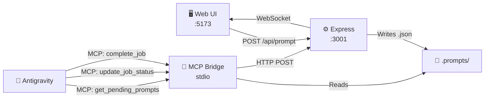

# Remotion Prompt Studio — Walkthrough

## What Was Built

A web application where you type a video prompt → Antigravity IDE **directly** picks it up via MCP bridge → generates all assets → video plays back in the UI. Real-time status updates flow from agent to UI via WebSocket.

## Architecture



**Direct integration flow:**
1. User types prompt in UI → Express writes `.prompts/{id}.json`
2. Antigravity agent calls `get_pending_prompts` MCP tool → sees new work
3. Agent calls `update_job_status` → MCP server POSTs to Express → WebSocket pushes to UI **instantly**
4. Agent generates script, voiceover, images, composition
5. Agent calls `complete_job` → UI shows ✅ done

## UI Preview


## MCP Bridge Integration

Registered in `~/.gemini/antigravity/mcp_config.json`:

```json
{
  "mcpServers": {
    "remotion-prompt-studio": {
      "command": "npx",
      "args": ["tsx", "c:\\Users\\ADMIN\\Desktop\\remotion\\mcp-bridge\\server.ts"]
    }
  }
}
```

### Available MCP Tools

| Tool | Direction | Purpose |
|---|---|---|
| `get_pending_prompts` | Agent ← UI | Check for new prompts |
| `get_prompt_details` | Agent ← UI | Get full instructions for a job |
| `update_job_status` | Agent → UI | Push real-time progress (0-100%) |
| `complete_job` | Agent → UI | Signal completion |

## Files Created (23 files)

### Core Config (6)
| File | Purpose |
|---|---|
| [package.json](file:///c:/Users/ADMIN/Desktop/remotion/package.json) | Dependencies + scripts |
| [tsconfig.json](file:///c:/Users/ADMIN/Desktop/remotion/tsconfig.json) | TypeScript config |
| [remotion.config.ts](file:///c:/Users/ADMIN/Desktop/remotion/remotion.config.ts) | Remotion rendering config |
| [vite.config.ts](file:///c:/Users/ADMIN/Desktop/remotion/vite.config.ts) | Vite + proxy to Express |
| [.env.example](file:///c:/Users/ADMIN/Desktop/remotion/.env.example) | API key template |
| [.gitignore](file:///c:/Users/ADMIN/Desktop/remotion/.gitignore) | Exclusions |

### MCP Bridge (1)
| File | Purpose |
|---|---|
| [server.ts](file:///c:/Users/ADMIN/Desktop/remotion/mcp-bridge/server.ts) | Direct Antigravity integration via MCP protocol |

### Express Server (1)
| File | Purpose |
|---|---|
| [server.ts](file:///c:/Users/ADMIN/Desktop/remotion/server/server.ts) | REST API + WebSocket + file watcher |

### Remotion Compositions (3)
| File | Purpose |
|---|---|
| [index.ts](file:///c:/Users/ADMIN/Desktop/remotion/src/index.ts) | Remotion entry point |
| [Root.tsx](file:///c:/Users/ADMIN/Desktop/remotion/src/remotion/Root.tsx) | Auto-discovers compositions |
| [PromptVideo.tsx](file:///c:/Users/ADMIN/Desktop/remotion/src/remotion/PromptVideo.tsx) | Generic video (grain, particles, kinetic captions) |

### Web UI (8)
| File | Purpose |
|---|---|
| [index.html](file:///c:/Users/ADMIN/Desktop/remotion/index.html) | Vite HTML entry |
| [main.tsx](file:///c:/Users/ADMIN/Desktop/remotion/src/ui/main.tsx) | React entry |
| [index.css](file:///c:/Users/ADMIN/Desktop/remotion/src/ui/index.css) | Dark theme design system |
| [App.tsx](file:///c:/Users/ADMIN/Desktop/remotion/src/ui/App.tsx) | Three-panel layout |
| [PromptPanel.tsx](file:///c:/Users/ADMIN/Desktop/remotion/src/ui/components/PromptPanel.tsx) | Template + prompt input |
| [VideoPlayer.tsx](file:///c:/Users/ADMIN/Desktop/remotion/src/ui/components/VideoPlayer.tsx) | Video playback + controls |
| [JobHistory.tsx](file:///c:/Users/ADMIN/Desktop/remotion/src/ui/components/JobHistory.tsx) | Past jobs sidebar |
| [StatusBar.tsx](file:///c:/Users/ADMIN/Desktop/remotion/src/ui/components/StatusBar.tsx) | Progress bar + step indicators |

### Shared + Docs (4)
| File | Purpose |
|---|---|
| [types.ts](file:///c:/Users/ADMIN/Desktop/remotion/src/lib/types.ts) | Shared type definitions |
| [constants.ts](file:///c:/Users/ADMIN/Desktop/remotion/src/lib/constants.ts) | FPS, palettes, paths |
| [SKILL.md](file:///c:/Users/ADMIN/Desktop/remotion/.agents/skills/prompt-watcher/SKILL.md) | Agent skill with MCP workflow |
| [BRD.md](file:///c:/Users/ADMIN/Desktop/remotion/docs/BRD.md), [PRD.md](file:///c:/Users/ADMIN/Desktop/remotion/docs/PRD.md), [SRS.md](file:///c:/Users/ADMIN/Desktop/remotion/docs/SRS.md) | Full documentation |

## Verification Results

| Check | Result |
|---|---|
| `npm install` | ✅ 355 packages, 0 vulnerabilities |
| `tsc --noEmit` | ✅ 0 errors (including MCP bridge) |
| Express server | ✅ Running on port 3001 |
| Vite UI | ✅ Running on port 5173 |
| UI renders | ✅ Three-panel dark theme layout |
| WebSocket | ✅ "Server Connected" indicator |
| Prompt submission | ✅ `.prompts/d6223984.json` created |
| Job history | ✅ Updates with status indicators |
| MCP config | ✅ Registered in `mcp_config.json` |

## How to Use

```bash
cd c:\Users\ADMIN\Desktop\remotion
npm run start    # Starts Express (3001) + Vite UI (5173)
```

1. Open **http://localhost:5173**
2. Select template → type prompt → **🚀 Generate Video**
3. **Antigravity receives it directly** via MCP tools
4. Agent calls `update_job_status` throughout → UI shows real-time progress
5. Agent calls `complete_job` → video plays in the UI player

> **Note:** After updating `mcp_config.json`, restart Antigravity IDE to load the MCP server.
