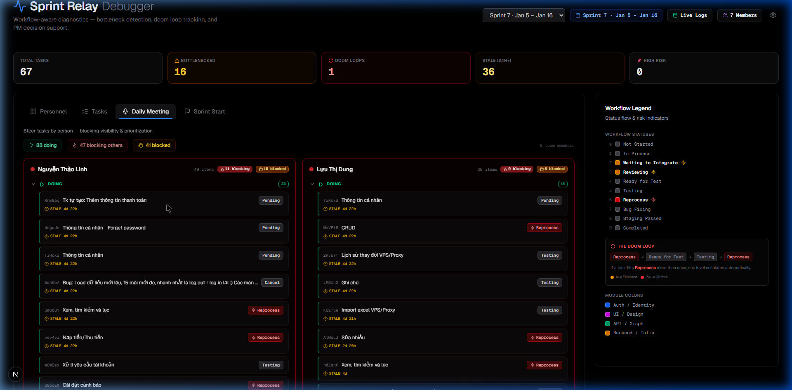

# Daily Meeting View — Walkthrough

## What Was Built

A new **"Daily Meeting"** tab for steering tasks during standup meetings, with per-person blocking visibility and priority-ordered sections.

### Files Created
- [useDailyMeeting.ts](file:///c:/Users/Admin/Desktop/Sprintdebug/sprint-relay/src/lib/hooks/useDailyMeeting.ts) — Data hook computing per-person meeting data from analyses, meeting notes, and sprint start entries
- [DailyMeetingView.tsx](file:///c:/Users/Admin/Desktop/Sprintdebug/sprint-relay/src/components/dashboard/DailyMeetingView.tsx) — UI component with person cards and 4 collapsible sections

### Files Modified
- [page.tsx](file:///c:/Users/Admin/Desktop/Sprintdebug/sprint-relay/src/app/page.tsx) — Added "Daily Meeting" tab, wired data flow

## How It Works

Each person gets a card with **4 priority-ordered sections**:

| Section | Source | Color |
|---|---|---|
| **Doing** | Tasks with active statuses (In Process, Testing, etc.) | 🟢 Emerald |
| **Blocking Others** | Tasks where this person is named as `blockedBy` in meeting notes | 🔴 Red |
| **Blocked By Others** | This person's tasks blocked by someone else via meeting notes | 🟡 Amber |
| **Not Started** | Tasks with "Not Started" status | ⚪ Muted |

Persons are sorted by **urgency score** (most "blocking others" first).

## Verification

- ✅ Tab renders with correct icon and description
- ✅ Summary stats bar shows totals (88 doing, 47 blocking, 41 blocked)
- ✅ Person cards display with blocking/blocked badges
- ✅ Tasks show status badges, stale indicators, and are clickable
- ✅ Clicking a task opens the StandupInspector detail panel
- ✅ No console errors

