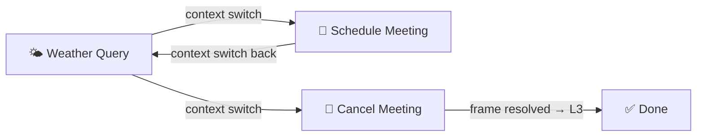

# AI Agent Context Architecture — Enhanced Design + Interactive Demo

## What Was Built

### 1. Enhanced Architecture (your L1–L4 model, expanded)

Your original 4-layer context model was enhanced with:

| Layer | Enhancement |
|---|---|
| **L1 Active** | Explicit token budget (~4K), eviction rules (slides to L2 after each turn) |
| **L2 Working Memory** | Formalized as a **TaskFrame stack** — each task is a structured frame with entities, status, and tool history |
| **L3 Episodic** | LLM-generated 2-3 sentence summaries of resolved frames, salience-based eviction |
| **L4 Long-term** | Key-value / vector DB retrieval with relevance scoring, ~2K token budget per turn |

**New additions on top of your model:**
- **Intent Detection Pipeline** — 7-type taxonomy (query, command, follow_up, context_switch, clarification, correction, meta) with confidence scoring
- **TaskFrame** — Structured object with `id, topic, intent, entities, tool_history, status` and full lifecycle (active → suspended → resumed → resolved)
- **Context Switch Protocol** — Suspend current frame, search stack for matching suspended frame, resume or create new
- **Tool Orchestration** — Registry with schema-based selection, slot filling, auto-chaining, and error recovery

### 2. Interactive Demo

````carousel

<!-- slide -->

<!-- slide -->

````

**Files created in** `c:\Users\Admin\Desktop\Agent context design\`:

| File | Purpose |
|---|---|
| [index.html](file:///c:/Users/Admin/Desktop/Agent%20context%20design/index.html) | Main page — two-column layout (chat + internals dashboard) |
| [styles.css](file:///c:/Users/Admin/Desktop/Agent%20context%20design/styles.css) | Dark glassmorphism theme with animations |
| [engine.js](file:///c:/Users/Admin/Desktop/Agent%20context%20design/engine.js) | Simulation engine — 8-step scenario data, state management, rendering |

## Mock Conversation Scenario (8 steps)

The demo walks through a realistic multi-turn conversation demonstrating all core concepts:



| Step | Speaker | Action | Key Concept Shown |
|---|---|---|---|
| 1 | User | "What's the weather in Hanoi?" | Intent: `query` (94%), Tool: `weather_api`, New TaskFrame pushed |
| 2 | Agent | Returns weather data | L1 updated with response, L2 holds active frame |
| 3 | User | "Schedule meeting with Lan at 3pm" | **Context switch** → Weather frame suspended, Calendar frame pushed |
| 4 | Agent | Confirms meeting scheduled | Tool: `calendar_api.create_event` |
| 5 | User | "What was the temperature again?" | **Context switch back** → "temperature" matches suspended Weather frame, **no tool call needed** (L2 cache hit) |
| 6 | Agent | "31°C from earlier check" | Answer served from working memory |
| 7 | User | "Cancel that meeting with Lan" | **Context switch** → "meeting with Lan" matches Calendar frame entities |
| 8 | Agent | Confirms cancellation | Calendar frame **resolved** → compressed summary moves to L3 Episodic Memory |

## How to Use

Open `index.html` in any browser, then:
- **Next Step →** — advance one step at a time
- **▶ Auto-play** — auto-advance every 2.2 seconds
- **↺ Reset** — restart from the beginning

Watch the right panel update in real-time showing intent classification, context layer token usage, TaskFrame stack state, and tool execution logs.


